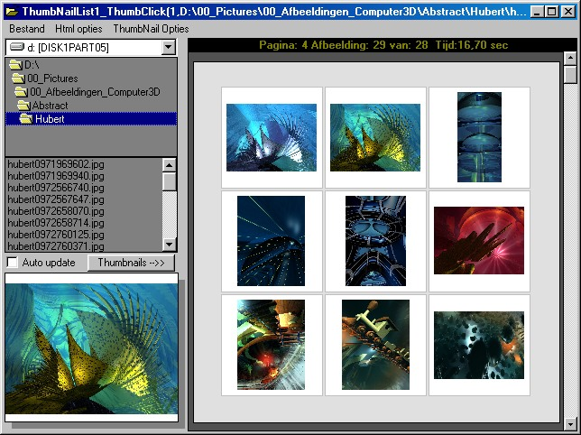



## Rs\-Thumbnail\-list\-control

### Description

----

Rs-Thumbnail-list-control

----

Purpose:

Thumbnail view from a list of pictures files in certain directory. Very simular to the welknown program "ACDSee".

The creation of a webpage(s) Master(index with thumbs)- Detail(full picture size), with links to the next or previous page.

Rs-Thumbnaillist control is not compiled to ActiveX control(OCX). You can use this control in the controls "private mode" directly into your own project. However.... as you know the control can be set to the "Public mode" compiled to an "OCX". I prefer embedded controls without dependencies to a lot of rubbish in the system directory. In my case just the standard vbruntime modules will be enough to run the program with advanced possibility's in itself. "Rs-Thumbnaillist control" is a very robust control control with a lot of options. It can handle a huge amount of pictures.... how ever... keep in mind that the every thing is working in VB and not c++.

- Resizable thumbnails 10x10 to 300x300 pixels.

- Preset and manual color scemes.

- Possibility to Generate Html output.

- Custom style sheets(Css)

- Created Thumbnails in html files in 'Jpg' format.

- - Low use of System resources
 
### More Info
 
index of Propertys:

AutoUpdateOnPathchange

Compress_NO_GIF

CompressToJPG

Create_Default_Css

Html_PageBackcolor

Html_PageColorPresets

Html_PageForecolor

Html_PageFotoframeBackColor

Html_PageFotoframeBorderColor

Html_PageFotoLinkstyle

Html_PageLineColor

Html_PageLinkColor

Html_PageLinkHoverBackColor

Html_PageLinkHoverForeColor

Html_ThumbnailBorderColor

Html_ThumbnailBorderThicknes

Html_ThumbnailSize

InfoBackColor

InfobarVisible

InfoForeColor

Language

Makegallery

MakeHtmlGallery

MaxThumbnailpages

Path

Print_NrThumbCols

Print_Zoomfactor

PrintPicture

PrintPreview

PrintResolution

ThumbNailBorderColor

ThumbNailColor

ThumbnailExtraHeight

ThumbnailExtraWidth

ThumbnailPagesNeeded

ThumbNailSelectColor

ThumbNailSize

ThumbPage_FrameColor

ThumbPageColor

ThumbPageColorPresets

             |
---                |---
**Submitted On**   |2002-06-17 21:13:26
**By**             |[Roy Smol](https://github.com/Planet-Source-Code/PSCIndex/blob/master/ByAuthor/roy-smol.md)
**Level**          |Advanced
**User Rating**    |5.0 (45 globes from 9 users)
**Compatibility**  |VB 5\.0, VB 6\.0
**Category**       |[Graphics](https://github.com/Planet-Source-Code/PSCIndex/blob/master/ByCategory/graphics__1-46.md)
**World**          |[Visual Basic](https://github.com/Planet-Source-Code/PSCIndex/blob/master/ByWorld/visual-basic.md)
**Archive File**   |[Rs\-Thumbna955626172002\.zip](https://github.com/Planet-Source-Code/roy-smol-rs-thumbnail-list-control__1-35968/archive/master.zip)

